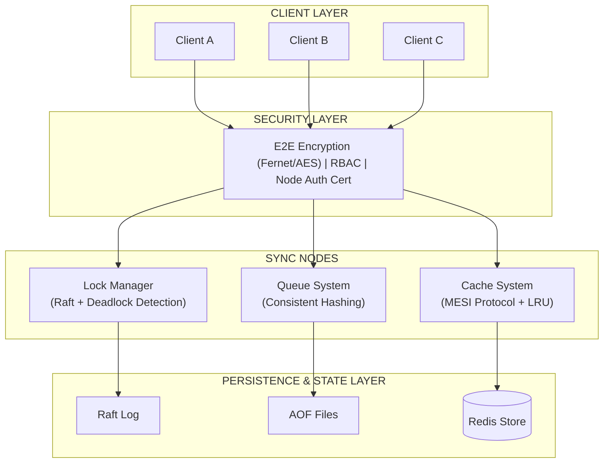
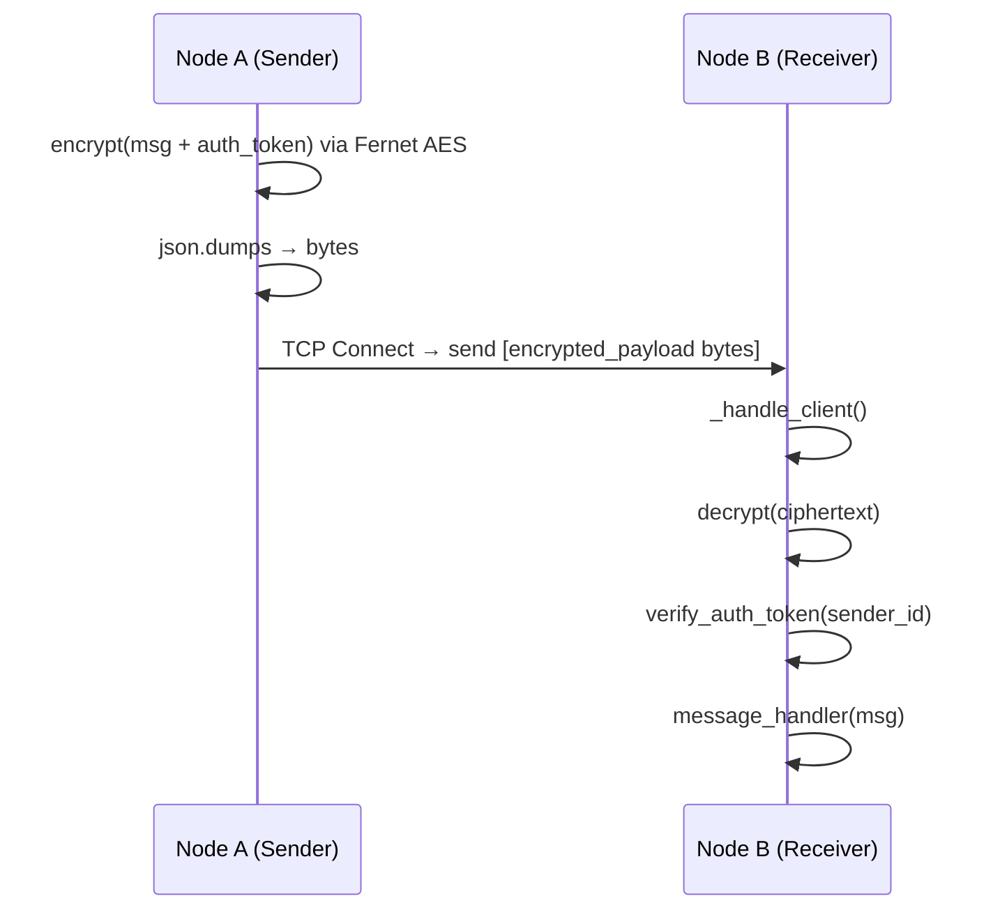
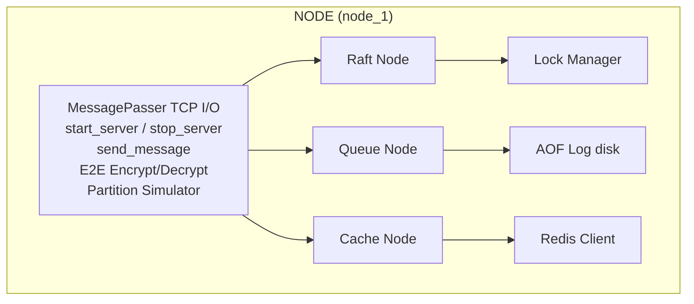
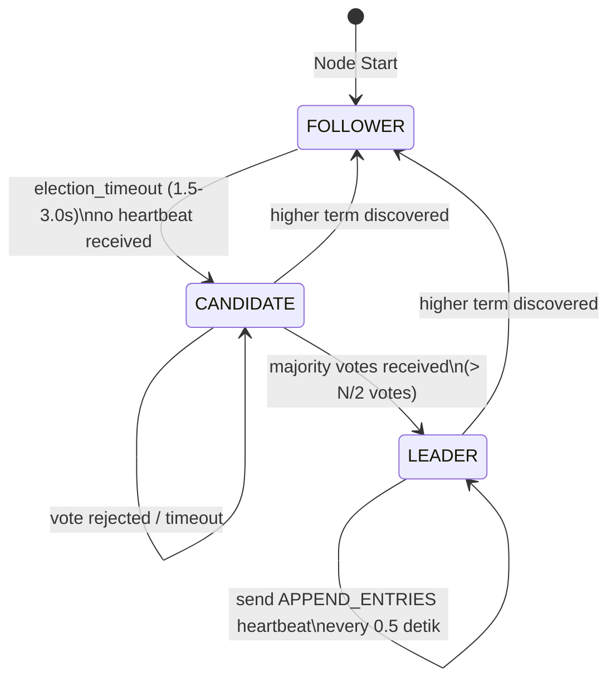
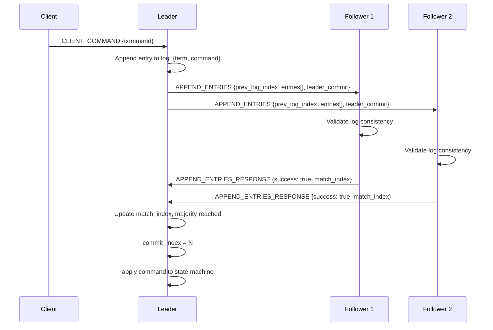
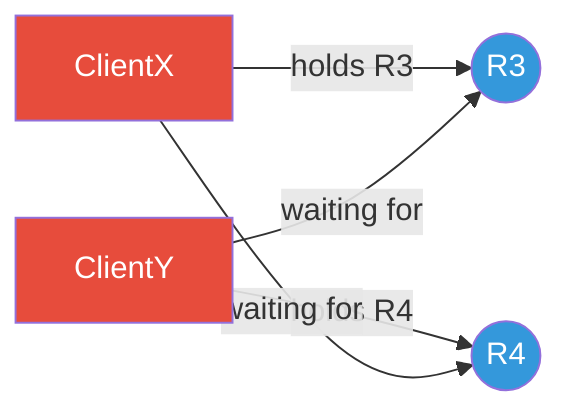
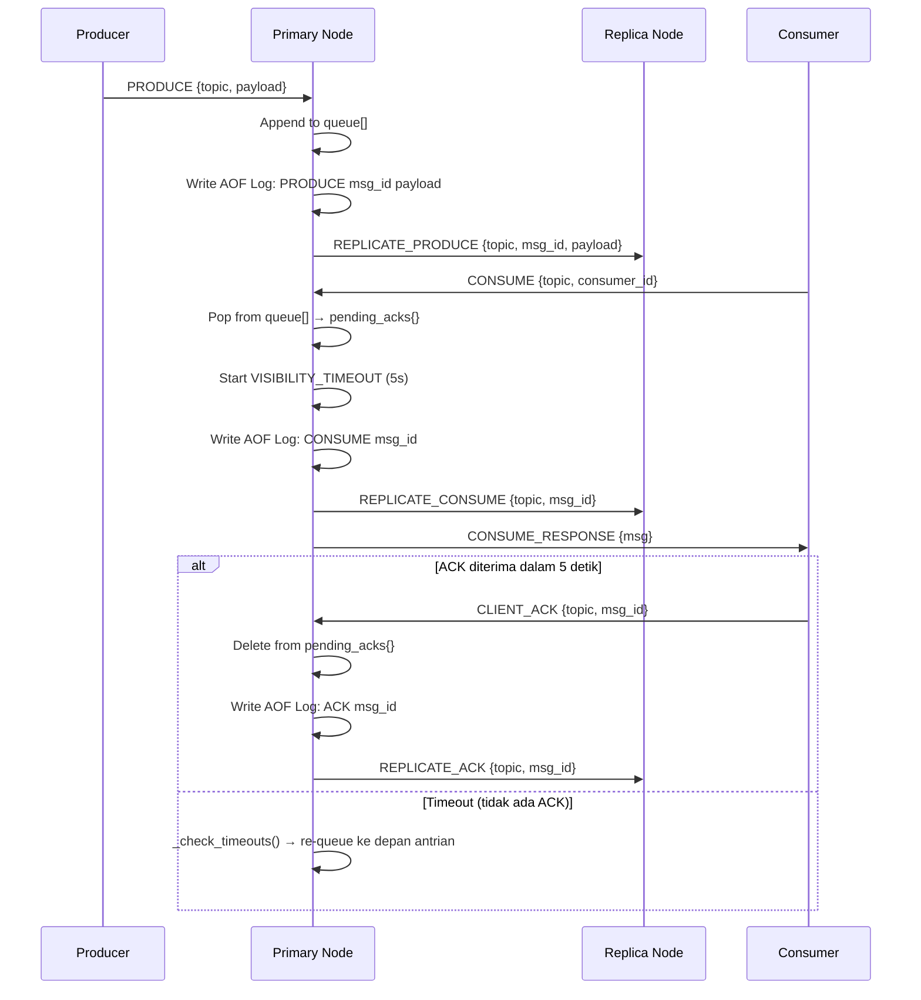
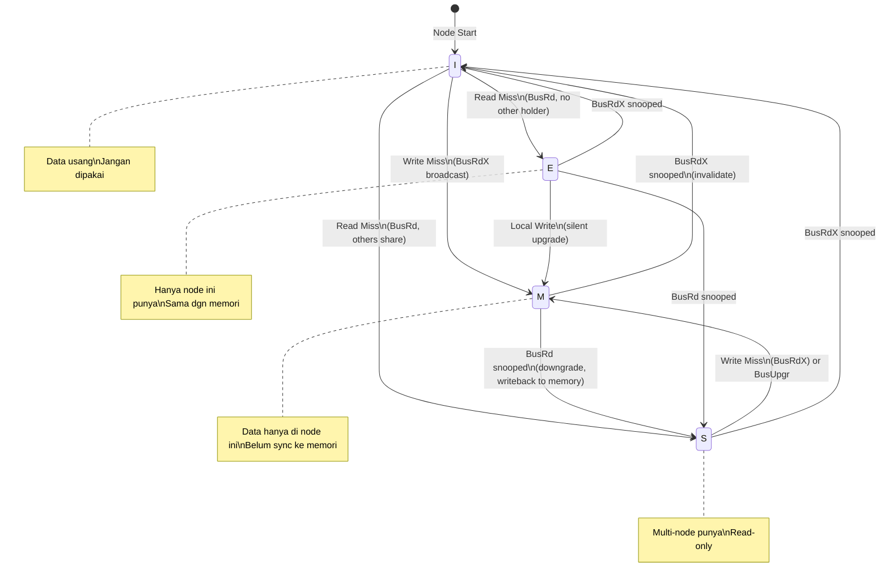
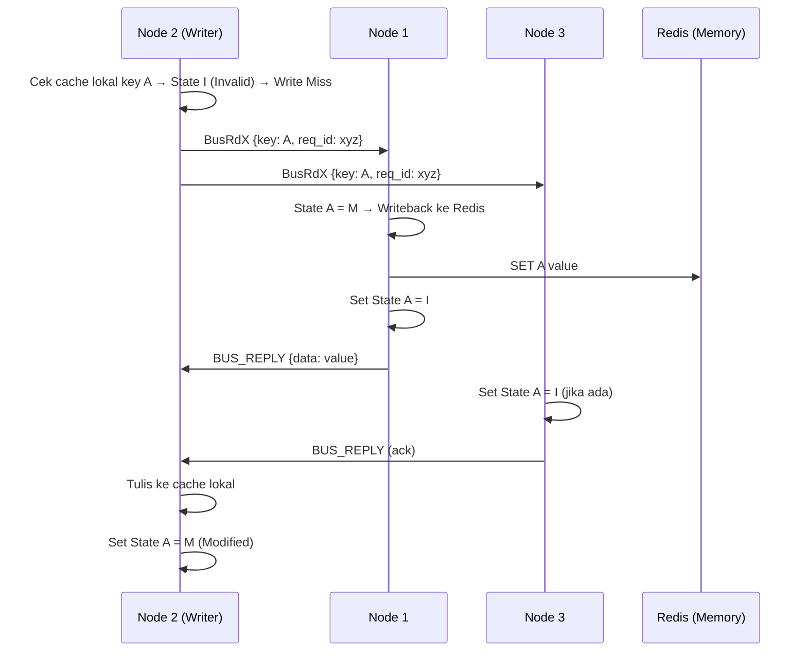
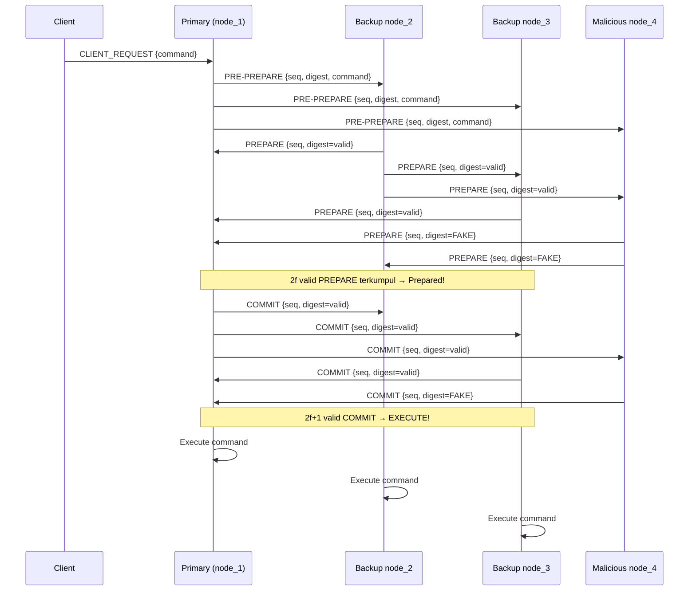

# Technical Documentation: Distributed Sync System

---

## 1. Arsitektur Sistem

### 1.1 Gambaran Umum (High-Level Overview)

Sistem ini adalah platform sinkronisasi terdistribusi berbasis **Peer-to-Peer (P2P)** yang terdiri dari tiga subsistem utama, masing-masing dirancang untuk menyelesaikan tantangan spesifik dalam sistem terdistribusi. Komunikasi antar-node menggunakan **TCP Sockets asinkron** yang dibangun di atas `asyncio`, dengan lapisan enkripsi **Fernet (AES)** untuk keamanan.



### 1.2 Diagram Komunikasi Antar-Node

Setiap node menjalankan TCP server sendiri. Komunikasi dilakukan sepenuhnya secara asinkron. Sebelum pesan dikirim, `MessagePasser` mengenkripsinya dan menambahkan *auth token*.



### 1.3 Diagram Komponen Per Node



---

## 2. Penjelasan Algoritma

### 2.1 Distributed Lock Manager — Algoritma Raft

**File:** `src/consensus/raft.py`, `src/nodes/lock_manager.py`

#### Cara Kerja Raft (Normal Operation)
Raft memisahkan konsensus menjadi tiga sub-problem: **Leader Election**, **Log Replication**, dan **Safety**.

**a. Leader Election**


**b. Log Replication**


**c. Deadlock Detection (Wait-For Graph)**

`LockManager` memelihara graf arah di mana `A → B` berarti "A menunggu resource yang dipegang B".



> **CYCLE DETECTED!** ClientX → R4 → ClientY → R3 → ClientX. Permintaan ACQUIRE_LOCK dari ClientY ditolak.

**Parameter Konfigurasi Raft:**
| Parameter | Nilai | Keterangan |
|---|---|---|
| `RAFT_ELECTION_TIMEOUT_MIN` | 1.5 detik | Batas bawah timeout acak |
| `RAFT_ELECTION_TIMEOUT_MAX` | 3.0 detik | Batas atas timeout acak |
| `RAFT_HEARTBEAT_INTERVAL` | 0.5 detik | Interval heartbeat dari Leader |

---

### 2.2 Distributed Queue System — Consistent Hashing

**File:** `src/utils/consistent_hashing.py`, `src/nodes/queue_node.py`

#### a. Consistent Hash Ring dengan Virtual Nodes

```
Physical Nodes: [node_1, node_2, node_3]
Virtual Nodes per Physical Node: 100

Hash Ring (lingkaran 0 ... 2^128):
   0                                          2^128
   |──────────────────────────────────────────|
   |..n1_#0..n2_#0..n3_#0..n1_#1..n2_#1.....│
               ↑
         Hash("orders") → menunjuk ke node_2 sebagai Primary
```

**Algoritma `get_replicas(key, count=2)`:**
1. Hitung `hash(key)` menggunakan MD5.
2. Cari node pertama di ring yang `hash ≥ hash(key)` → ini adalah **Primary**.
3. Berjalan searah jarum jam di ring untuk menemukan node **berbeda** berikutnya → ini adalah **Replica**.
4. Kembalikan daftar `[primary, replica_1, ...]`.

**Manfaat:** Jika satu node mati, hanya ~`1/N` data yang berpindah ke node lain, bukan semua data di-redistribute.

#### b. At-Least-Once Delivery (Visibility Timeout)



#### c. Persistensi dengan AOF (Append-Only File)

Format log: `<OPERATION> <msg_id> [arg2]\n`

Contoh file `data/queue_logs/node_1/orders.log`:
```
PRODUCE a1b2-c3d4 {"order_id": 123}
PRODUCE e5f6-g7h8 {"order_id": 456}
CONSUME a1b2-c3d4 consumer_A
ACK a1b2-c3d4
```

Saat restart, file dibaca ulang secara berurutan untuk merekonstruksi state antrian.

---

### 2.3 Distributed Cache Coherence — Protokol MESI

**File:** `src/nodes/cache_node.py`

#### a. State Transitions MESI

| State | Arti | Kapan Terjadi |
|---|---|---|
| **M** (Modified) | Data terbaru hanya ada di node ini, belum disinkronkan ke memori | Setelah operasi `write` berhasil |
| **E** (Exclusive) | Hanya node ini yang menyimpan data, sama dengan memori | Setelah `read` dari memori tanpa ada node lain yang punya |
| **S** (Shared) | Beberapa node menyimpan data yang sama (read-only) | Setelah `BusRd` disambut oleh node lain |
| **I** (Invalid) | Data sudah usang, tidak boleh digunakan | Setelah menerima `BusRdX` atau `BusUpgr` dari node lain |

#### b. Diagram Transisi State



#### c. LRU Cache Replacement Policy

Implementasi menggunakan `collections.OrderedDict`. Setiap akses (`read`/`write`) memindahkan key ke ujung kanan (*most recently used*). Saat kapasitas penuh, item di ujung kiri (*least recently used*) dikeluarkan.

```python
# Pseudocode LRU Eviction
if len(cache) > cache_size:
    lru_key, lru_line = cache.popitem(last=False)  # Hapus LRU
    if lru_line.state == 'M':
        writeback(lru_key, lru_line.value) → Redis  # Jangan hilangkan data kotor!
```

#### d. Bus Snooping Protocol



---

### 2.4 PBFT (Bonus) — Byzantine Fault Tolerance

**File:** `src/consensus/pbft.py`

#### 3-Phase Commit PBFT



**Toleransi kegagalan:** $f = \lfloor(N-1)/3\rfloor$. Untuk N=4: **f=1** (menoleransi 1 node jahat).

**Node Curang (Malicious Mode):**
- Pada fase PREPARE dan COMMIT, node curang mengirimkan `"FAKE_DIGEST"` yang tidak cocok dengan hash asli perintah.
- Node jujur mengabaikan suara yang digest-nya tidak cocok → node curang tidak dapat mengganggu konsensus karena tidak memiliki cukup suara ($2f+1$).

---

## 3. API Documentation (Message Specification)

Seluruh komunikasi dilakukan via JSON yang dienkripsi melalui TCP. Berikut adalah spesifikasi pesan untuk setiap subsistem.

### 3.1 Distributed Lock API

#### `ACQUIRE_LOCK` — Permintaan Kunci
```json
{
  "type": "ACQUIRE_LOCK",
  "resource": "string",
  "client_id": "string",
  "mode": "exclusive | shared"
}
```

| Field | Tipe | Deskripsi |
|---|---|---|
| `resource` | string | Identifier resource yang akan dikunci (e.g., `"R1"`) |
| `client_id` | string | Identifier unik klien yang meminta kunci |
| `mode` | enum | `"exclusive"` (hanya satu pemegang) atau `"shared"` (multi-reader) |

#### `RELEASE_LOCK` — Melepas Kunci
```json
{
  "type": "RELEASE_LOCK",
  "resource": "string",
  "client_id": "string"
}
```

#### Internal Raft Messages

| Message Type | Pengirim | Penerima | Deskripsi |
|---|---|---|---|
| `REQUEST_VOTE` | Candidate | All Peers | Meminta suara untuk menjadi Leader |
| `VOTE_RESPONSE` | Follower | Candidate | Balasan vote (granted/denied) |
| `APPEND_ENTRIES` | Leader | All Followers | Replikasi log & heartbeat |
| `APPEND_ENTRIES_RESPONSE` | Follower | Leader | Balasan replikasi log |

---

### 3.2 Distributed Queue API

#### `CLIENT_PRODUCE` — Mengirim Pesan ke Antrian
```json
{
  "type": "CLIENT_PRODUCE",
  "topic": "string",
  "payload": "string",
  "msg_id": "string (UUID, opsional)",
  "client_id": "string (opsional)"
}
```

**Response `PRODUCE_OK`:**
```json
{
  "type": "PRODUCE_OK",
  "msg_id": "string (UUID)"
}
```

#### `CLIENT_CONSUME` — Mengambil Pesan dari Antrian
```json
{
  "type": "CLIENT_CONSUME",
  "topic": "string",
  "consumer_id": "string",
  "sender_id": "string"
}
```

**Response `CONSUME_RESPONSE`:**
```json
{
  "type": "CONSUME_RESPONSE",
  "topic": "string",
  "msg": {
    "msg_id": "string",
    "payload": "string"
  }
}
```
> `msg` akan bernilai `null` jika antrian kosong.

#### `CLIENT_ACK` — Konfirmasi Pesan Berhasil Diproses
```json
{
  "type": "CLIENT_ACK",
  "topic": "string",
  "msg_id": "string"
}
```

#### Internal Replication Messages

| Message Type | Deskripsi |
|---|---|
| `REPLICATE_PRODUCE` | Primary → Replica: Salin pesan baru |
| `REPLICATE_CONSUME` | Primary → Replica: Sinkronisasi status consumed |
| `REPLICATE_ACK` | Primary → Replica: Sinkronisasi status ACK |

---

### 3.3 Distributed Cache API

#### `BUS_RD` — Read Miss (Pesan Bus Baca)
```json
{
  "type": "BUS_RD",
  "key": "string",
  "req_id": "string",
  "requester_id": "string"
}
```

#### `BUS_RDEX` — Write Miss (Pesan Bus Tulis Eksklusif)
```json
{
  "type": "BUS_RDEX",
  "key": "string",
  "req_id": "string",
  "requester_id": "string"
}
```

#### `BUS_REPLY` — Balasan Bus dari Snooper
```json
{
  "type": "BUS_REPLY",
  "key": "string",
  "req_id": "string",
  "data": "any",
  "from_state": "M | E | S"
}
```

#### `MEM_READ` / `MEM_WRITE` — Akses Main Memory (Redis via Node Controller)
```json
{
  "type": "MEM_READ",
  "key": "string",
  "req_id": "string"
}
```
```json
{
  "type": "MEM_WRITE",
  "key": "string",
  "value": "any"
}
```

---

### 3.4 Security API

#### RBAC Permission Matrix

| User ID | Role | read | write | delete | manage_nodes |
|---|---|---|---|---|---|
| `client_A` | admin | ✅ | ✅ | ✅ | ✅ |
| `client_B` | user | ✅ | ✅ | ❌ | ❌ |
| `client_C` | guest | ✅ | ❌ | ❌ | ❌ |

#### Audit Log Entry Format
```json
{
  "event": {
    "timestamp": 1777633124.77,
    "event_type": "DATA_WRITE",
    "user_id": "client_A",
    "details": {"resource": "queue_1", "bytes": 500}
  },
  "prev_hash": "4b22c572179de4967cd...",
  "hash": "ae2ec2cc68b24f3fd460..."
}
```

---

## 4. Deployment Guide & Troubleshooting

### 4.1 Persyaratan Sistem

| Perangkat Lunak | Versi Minimum | Kegunaan |
|---|---|---|
| Python | 3.8+ | Runtime semua node |
| Docker | 20.x | Containerization |
| Docker Compose | 2.x | Orkestrasi multi-node |
| Redis | 6.x | Distributed state (Cache) |

**Dependensi Python** (dari `requirements.txt`):
```
cryptography==41.0.3
redis==5.0.1
pytest==7.4.2
pytest-asyncio==0.21.1
locust==2.16.1
```

---

### 4.2 Instalasi & Konfigurasi

#### Langkah 1: Clone dan Persiapan Environment
```bash
# Masuk ke direktori proyek
cd distributed-sync-system

# Install dependensi Python
pip install -r requirements.txt
```

#### Langkah 2: Konfigurasi `.env`

Salin file template dan sesuaikan:
```bash
copy .env.example .env
```

Isi file `.env`:
```env
# Konfigurasi kluster (format: node_id:host:port,...)
CLUSTER_NODES=node_1:node_1:8001,node_2:node_2:8002,node_3:node_3:8003

# Konfigurasi Redis
REDIS_HOST=localhost
REDIS_PORT=6379
```

> **Catatan:** Saat berjalan di Docker, `REDIS_HOST` menggunakan nama service (`redis`). Saat pengujian lokal, gunakan `localhost`.

#### Langkah 3: Dynamic Scaling

Untuk menambah node menjadi 5 tanpa mengubah kode Python:
1. Edit `.env`:
```env
CLUSTER_NODES=node_1:node_1:8001,node_2:node_2:8002,node_3:node_3:8003,node_4:node_4:8004,node_5:node_5:8005
```
2. Tambahkan service baru di `docker-compose.yml`:
```yaml
  node_4:
    build: .
    command: ["--node-id", "node_4", "--service", "queue"]
    env_file: [.env]
    networks: [sync_network]
```

---

### 4.3 Menjalankan Sistem

#### Mode Development (Lokal, Tanpa Docker)

Jalankan setiap node di terminal terpisah:
```bash
# Terminal 1
python main.py --node-id node_1 --service lock

# Terminal 2
python main.py --node-id node_2 --service lock

# Terminal 3
python main.py --node-id node_3 --service lock
```

#### Mode Produksi (Docker Compose)

```bash
# Build dan jalankan semua container di background
docker-compose up --build -d

# Lihat log semua container secara real-time
docker-compose logs -f

# Hentikan semua container
docker-compose down
```

---

### 4.4 Menjalankan Pengujian

#### Unit & Integration Tests (Pytest)
```bash
# Jalankan semua tes sekaligus
pytest tests/integration/ -v

# Jalankan satu file tes spesifik
pytest tests/integration/test_lock_manager.py -v

# Jalankan tes dengan output log detail
pytest tests/integration/ -v -s
```

**Output yang diharapkan:**
```
5 passed in ~37.00s
```

#### Load Testing (Locust)

Pastikan node Queue sudah berjalan, lalu:
```bash
# Mode headless (CLI) — 100 user, spawn 10/detik, durasi 30 detik
locust -f locustfile.py --headless -u 100 -r 10 -t 30s

# Mode GUI — buka browser di http://localhost:8089
locust -f locustfile.py
```

---

### 4.5 Troubleshooting

| Masalah | Kemungkinan Penyebab | Solusi |
|---|---|---|
| `KeyError: 'node_1'` | `CLUSTER_NODES` di `.env` tidak cocok dengan `node_id` yang diberikan | Pastikan `node_id` yang dipakai ada di konfigurasi |
| `ConnectionRefusedError` | Node tujuan belum menyala atau port salah | Periksa apakah semua node sudah `start()` dan portnya unik |
| `Decryption failed` | Node tidak menggunakan `SHARED_SECRET` yang sama | Pastikan semua node menggunakan file `src/security/crypto.py` yang sama |
| `redis.ConnectionError` | Server Redis belum berjalan | Jalankan `docker-compose up redis` atau install Redis lokal |
| `Audit Chain Broken` | File log audit dimodifikasi secara manual | Jalankan `logger.verify_chain()` untuk mendiagnosis baris yang rusak |
| `No leader elected` | Timeout election terlalu pendek atau ada partisi jaringan | Tunggu 6+ detik atau panggil `heal_partition()` |
| `pytest-asyncio mode=STRICT` | Dekorator `@pytest.mark.asyncio` tidak ada di fungsi tes | Tambahkan dekorator ke setiap fungsi `async def test_*` |

---

### 4.6 Struktur Direktori Proyek

```
distributed-sync-system/
├── src/
│   ├── communication/
│   │   ├── message_passing.py    # TCP I/O + E2E Encryption
│   │   └── failure_detector.py   # Node failure detection
│   ├── consensus/
│   │   ├── raft.py               # Raft consensus algorithm
│   │   └── pbft.py               # PBFT (Byzantine Fault Tolerance)
│   ├── nodes/
│   │   ├── base_node.py          # Abstract base class
│   │   ├── lock_manager.py       # Distributed Lock (Part A)
│   │   ├── queue_node.py         # Distributed Queue (Part B)
│   │   └── cache_node.py         # Cache Coherence MESI (Part C)
│   ├── security/
│   │   ├── crypto.py             # E2E Encryption + Node Certs
│   │   ├── rbac.py               # Role-Based Access Control
│   │   └── audit.py              # Tamper-Proof Audit Logging
│   └── utils/
│       ├── config.py             # Cluster configuration
│       ├── consistent_hashing.py # Hash Ring for Queue
│       └── metrics.py            # System performance metrics
├── tests/
│   └── integration/
│       ├── test_lock_manager.py  # Test Part A
│       ├── test_queue_system.py  # Test Part B
│       ├── test_cache_system.py  # Test Part C
│       ├── test_pbft.py          # Test PBFT Bonus
│       └── test_security.py      # Test Security Bonus
├── data/
│   ├── queue_logs/               # AOF persistence files
│   └── audit_logs/               # Tamper-proof audit logs
├── scripts/
│   └── benchmark.py              # Performance benchmarking
├── main.py                       # Unified node entrypoint
├── locustfile.py                 # Load testing script
├── Dockerfile                    # Container image definition
├── docker-compose.yml            # Multi-container orchestration
├── requirements.txt              # Python dependencies
├── .env                          # Runtime configuration
└── .env.example                  # Configuration template
```
