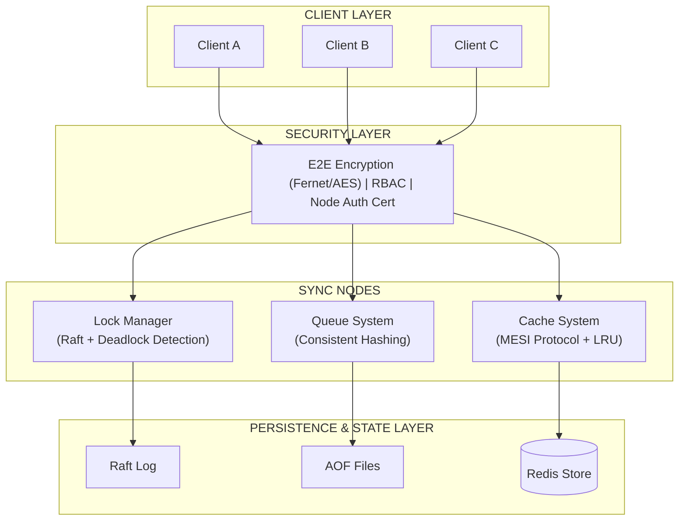
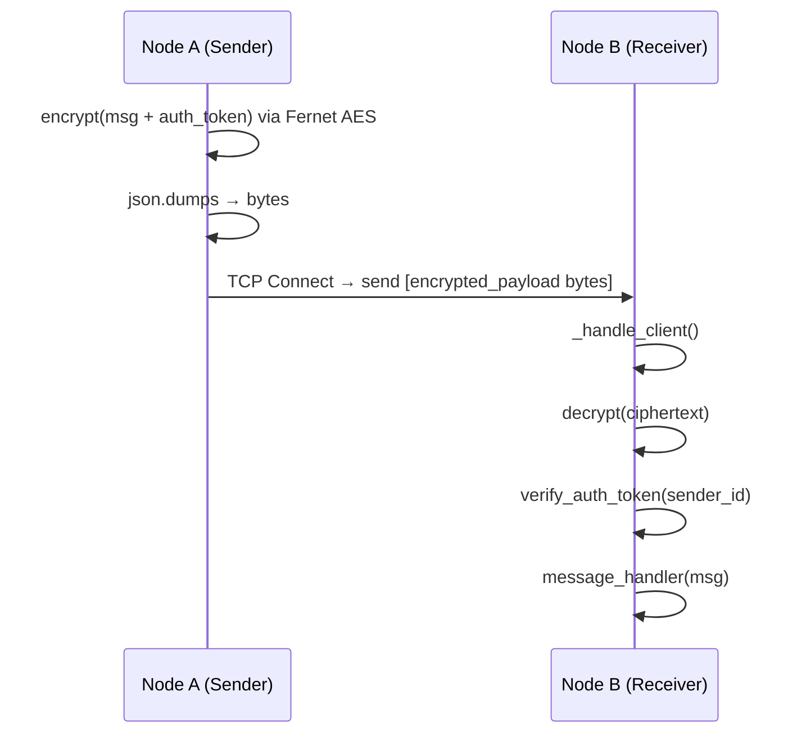
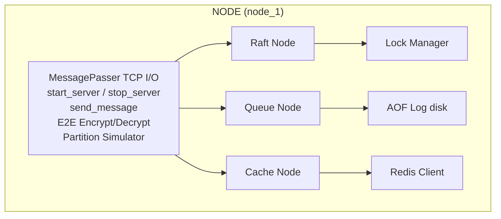

# Technical Documentation: Distributed Sync System

---

## 1. Arsitektur Sistem

### 1.1 Gambaran Umum (High-Level Overview)

Sistem ini adalah platform sinkronisasi terdistribusi berbasis **Peer-to-Peer (P2P)** yang terdiri dari tiga subsistem utama, masing-masing dirancang untuk menyelesaikan tantangan spesifik dalam sistem terdistribusi. Komunikasi antar-node menggunakan **TCP Sockets asinkron** yang dibangun di atas `asyncio`, dengan lapisan enkripsi **Fernet (AES)** untuk keamanan.



### 1.2 Diagram Komunikasi Antar-Node

Setiap node menjalankan TCP server sendiri. Komunikasi dilakukan sepenuhnya secara asinkron. Sebelum pesan dikirim, `MessagePasser` mengenkripsinya dan menambahkan *auth token*.



### 1.3 Diagram Komponen Per Node



---

## 2. Penjelasan Algoritma

### 2.1 Distributed Lock Manager — Algoritma Raft

**File:** `src/consensus/raft.py`, `src/nodes/lock_manager.py`

Distributed Lock Manager bertugas memastikan bahwa hanya satu klien yang boleh mengakses suatu resource pada satu waktu (*exclusive lock*), atau beberapa klien boleh membaca secara bersamaan (*shared lock*). Untuk menjamin konsistensi keputusan ini di seluruh node, digunakan algoritma **Raft Consensus**.

#### a. Leader Election

Setiap node dalam kluster Raft selalu berada di salah satu dari tiga kondisi: **Follower**, **Candidate**, atau **Leader**.

Saat sistem pertama kali berjalan, semua node masuk sebagai **Follower** dan menunggu sinyal dari Leader. Jika dalam rentang waktu tertentu — disebut *election timeout*, dipilih secara acak antara **1.5–3.0 detik** — tidak ada sinyal heartbeat yang datang, Follower berasumsi bahwa Leader sudah mati dan memutuskan untuk maju menjadi **Candidate**.

Sebagai Candidate, node menaikkan nomor periode (`term`), memberikan suara untuk dirinya sendiri, lalu mengirim pesan `REQUEST_VOTE` ke seluruh node lain. Node lain membalas dengan memberikan suara jika mereka belum memilih di periode yang sama dan log Candidate minimal sama lengkapnya dengan log mereka.

Jika satu Candidate berhasil mengumpulkan suara **mayoritas** (lebih dari separuh total node), ia menjadi **Leader**. Leader kemudian langsung mengirimkan pesan `APPEND_ENTRIES` kosong setiap **0.5 detik** sebagai heartbeat agar para Follower tahu bahwa Leader masih aktif.

#### b. Log Replication

Ketika klien ingin mengunci sebuah resource, permintaan tidak langsung diproses. Permintaan terlebih dahulu ditulis ke dalam **Raft Log** di node Leader sebagai *entry* baru berisi `{term, command}`.

Leader kemudian mengirimkan entry tersebut ke semua Follower melalui pesan `APPEND_ENTRIES`. Setiap Follower memvalidasi konsistensi log (dengan membandingkan `prev_log_index` dan `prev_log_term`). Jika valid, Follower menambahkan entry ke log lokalnya dan membalas `success: true`.

Ketika Leader menerima konfirmasi dari **mayoritas node**, entry dianggap *committed* dan baru dieksekusi ke state machine. Ini menjamin bahwa meskipun beberapa node crash, keputusan yang sudah commit tidak akan pernah hilang.

#### c. Deadlock Detection (Wait-For Graph)

Sebelum permintaan `ACQUIRE_LOCK` ditulis ke Raft Log, `LockManager` terlebih dahulu memeriksa apakah permintaan tersebut akan menyebabkan **deadlock**.

Caranya dengan memelihara sebuah **Wait-For Graph** — graf berarah di mana sisi `A → B` berarti "klien A menunggu resource yang dipegang klien B". Setiap ada permintaan baru, graf diperbarui dan dicek apakah terbentuk **siklus** menggunakan algoritma DFS.

Contoh: ClientX memegang R3 dan menunggu R4, sementara ClientY memegang R4 dan menunggu R3. Ini membentuk siklus `ClientX → ClientY → ClientX`. Sistem mendeteksi siklus ini dan langsung menolak permintaan yang terakhir masuk, sehingga deadlock tidak pernah terjadi.

**Parameter Konfigurasi Raft:**
| Parameter | Nilai | Keterangan |
|---|---|---|
| `RAFT_ELECTION_TIMEOUT_MIN` | 1.5 detik | Batas bawah timeout acak |
| `RAFT_ELECTION_TIMEOUT_MAX` | 3.0 detik | Batas atas timeout acak |
| `RAFT_HEARTBEAT_INTERVAL` | 0.5 detik | Interval heartbeat dari Leader |

---

### 2.2 Distributed Queue System — Consistent Hashing

**File:** `src/utils/consistent_hashing.py`, `src/nodes/queue_node.py`

Distributed Queue System mendistribusikan pesan ke antrian yang tersebar di beberapa node secara merata. Algoritma utamanya adalah **Consistent Hashing**, yang menentukan node mana yang bertanggung jawab atas topik tertentu.

#### a. Consistent Hash Ring dengan Virtual Nodes

Bayangkan sebuah lingkaran angka dari 0 sampai 2¹²⁸. Setiap node fisik ditempatkan di **100 titik** di lingkaran ini (bukan hanya satu), yang disebut *virtual nodes*. Untuk 3 node fisik, total ada 300 titik di lingkaran.

Ketika ada pesan masuk dengan topik `"orders"`, sistem menghitung hash MD5 dari `"orders"` menghasilkan sebuah angka di lingkaran. Sistem mencari titik virtual node pertama yang nilainya lebih besar atau sama dengan hash tersebut — itulah node **Primary**. Untuk replikasi, sistem berjalan searah jarum jam mencari titik dari **node fisik yang berbeda** — itulah node **Replica**.

Keunggulannya dibanding hashing biasa: jika satu node mati, hanya sekitar `1/N` pesan yang perlu dipindahkan. Pada hashing biasa (`hash % N`), semua pesan harus diremap ulang setiap ada perubahan node.

#### b. At-Least-Once Delivery dengan Visibility Timeout

Sistem menjamin setiap pesan **pasti diproses setidaknya satu kali**, meskipun consumer mengalami crash di tengah proses.

Saat **Producer** mengirim pesan, Primary Node menyimpan ke `queue[]`, mencatat ke AOF Log, lalu mereplikasi ke Replica Node.

Saat **Consumer** meminta pesan, Primary **tidak langsung menghapus** pesan. Pesan dipindahkan ke `pending_acks{}` dan timer **Visibility Timeout 5 detik** dimulai. Selama 5 detik ini, pesan tidak diberikan ke consumer lain.

- Jika consumer mengirim `CLIENT_ACK` dalam 5 detik → pesan dihapus secara permanen.
- Jika 5 detik berlalu tanpa ACK (consumer crash) → fungsi `_check_timeouts()` mengembalikan pesan ke depan antrian untuk diambil consumer lain.

#### c. Persistensi dengan AOF (Append-Only File)

Setiap operasi dicatat ke file log dengan format `OPERASI msg_id [argumen]`:

```
PRODUCE a1b2-c3d4 {"order_id": 123}
PRODUCE e5f6-g7h8 {"order_id": 456}
CONSUME a1b2-c3d4 consumer_A
ACK a1b2-c3d4
```

Ketika node restart setelah crash, file ini dibaca dari awal secara berurutan. Sistem memutar ulang setiap operasi sehingga state antrian kembali persis seperti sebelum crash — teknik yang sama dengan yang digunakan Redis dalam mode AOF persistence.

---

### 2.3 Distributed Cache Coherence — Protokol MESI

**File:** `src/nodes/cache_node.py`

Cache Coherence menjawab pertanyaan: bagaimana memastikan semua node melihat data yang sama, padahal masing-masing punya salinan data di cache lokalnya sendiri? Sistem ini menggunakan protokol **MESI** — singkatan dari empat kondisi yang bisa dimiliki sebuah data di cache.

#### a. Empat State MESI

**Modified (M)** — Data ini hanya ada di node saya dan sudah diubah sehingga berbeda dengan yang ada di Redis. Saya harus *flush* data ini ke Redis sebelum node lain membacanya.

**Exclusive (E)** — Data ini hanya ada di node saya, tapi nilainya masih sama dengan di Redis. Tidak ada node lain yang punya salinannya. Saya bisa mengubahnya langsung tanpa memberitahu siapapun.

**Shared (S)** — Beberapa node mempunyai salinan data ini dan semuanya bersifat *read-only*. Jika saya ingin mengubah data, saya harus memberitahu semua node lain untuk menghapus salinan mereka terlebih dahulu.

**Invalid (I)** — Data ini ada di cache saya tapi sudah tidak valid karena node lain baru saja mengubahnya. Saya tidak boleh menggunakannya dan harus memintanya dari Redis atau node yang punya versi terbaru.

#### b. Mekanisme Bus Snooping

Protokol MESI bekerja melalui **Bus Snooping**: setiap node "mendengarkan" semua pesan di jaringan — bahkan yang bukan ditujukan padanya — untuk mengetahui apakah ada perubahan data yang perlu ditindaklanjuti.

**Contoh Skenario Write Miss:**

Node 2 ingin menulis data baru untuk key `"A"`. Ia mengecek cache lokalnya dan menemukan state `I` (Invalid) — ini adalah *write miss*.

Node 2 menyiarkan pesan `BusRdX` (Bus Read Exclusive) ke semua node lain yang berarti: *"Saya akan menulis ke key A. Tolong invalidasi salinan kalian."*

Node 1 yang menerima BusRdX dan punya state `M` untuk key `"A"` harus segera *writeback* datanya ke Redis, lalu mengubah state-nya menjadi `I` dan membalas dengan mengirimkan nilai terbaru ke Node 2.

Setelah Node 2 menerima balasan, ia menulis ke cache lokalnya dan menetapkan state `M` — sekarang Node 2 adalah satu-satunya pemegang data terbaru.

#### c. LRU Cache Replacement Policy

Karena ukuran cache terbatas, sistem menggunakan kebijakan **LRU (Least Recently Used)** untuk menentukan data mana yang dikeluarkan saat cache penuh.

Implementasinya menggunakan `collections.OrderedDict`. Setiap akses (`read`/`write`) memindahkan key ke posisi paling akhir (*most recently used*). Saat kapasitas penuh, data di posisi paling awal (*least recently used*) dikeluarkan.

Satu aturan penting: jika data yang dikeluarkan berstatus `M` (Modified), ia harus terlebih dahulu ditulis ke Redis agar tidak hilang.

```python
# Pseudocode LRU Eviction
if len(cache) > cache_size:
    lru_key, lru_line = cache.popitem(last=False)  # Hapus LRU
    if lru_line.state == 'M':
        writeback(lru_key, lru_line.value)  # Simpan dulu ke Redis!
```

---

### 2.4 PBFT (Bonus) — Byzantine Fault Tolerance

**File:** `src/consensus/pbft.py`

PBFT (*Practical Byzantine Fault Tolerance*) adalah algoritma konsensus yang dirancang untuk situasi ekstrem: ketika ada node yang tidak hanya *crash*, tetapi aktif **berbohong** atau mengirim data yang salah secara sengaja. Node seperti ini disebut *Byzantine node* atau *malicious node*.

Raft tidak bisa menangani skenario ini karena Raft berasumsi semua node yang merespons adalah jujur. PBFT tidak membuat asumsi tersebut.

#### Toleransi Kegagalan

Rumusnya adalah `f = ⌊(N-1)/3⌋`, di mana N adalah total jumlah node. Sistem membutuhkan setidaknya `3f+1` node untuk menoleransi f node curang.

Dalam implementasi ini digunakan **4 node** (N=4), sehingga `f = 1`. Sistem dapat tetap berfungsi dengan benar meskipun ada **1 node yang berperilaku jahat**.

#### Tiga Fase Commit

**Fase 1 — PRE-PREPARE:** Saat klien mengirim perintah, node Primary membuat hash dari perintah tersebut (*digest*) dan menyiarkan pesan PRE-PREPARE berisi `{nomor urut, digest, perintah}` ke semua Backup node. Ini pemberitahuan bahwa "ada perintah baru yang perlu diproses."

**Fase 2 — PREPARE:** Setiap Backup node memverifikasi hash-nya. Jika valid, mereka menyiarkan pesan PREPARE berisi `{nomor urut, digest}` ke semua node lain. Sebuah node bisa lanjut ke fase berikutnya hanya setelah mengumpulkan `2f` pesan PREPARE dengan digest yang **sama**. Node curang yang mengirim digest palsu tidak punya cukup suara karena `2f` node jujur menggunakan digest yang benar.

**Fase 3 — COMMIT:** Setelah PREPARE selesai, setiap node menyiarkan pesan COMMIT. Perintah dieksekusi hanya setelah mengumpulkan `2f+1` pesan COMMIT dengan digest yang sama. Angka ini memastikan mayoritas absolut node jujur setuju.

#### Mengapa Node Curang Tidak Bisa Mengganggu?

Node curang bisa mengirim PREPARE dan COMMIT dengan digest yang salah, namun ia hanya menyumbang **1 suara palsu**. Tiga node jujur menyumbang **3 suara valid**. Ambang batas yang diperlukan adalah `2f+1 = 3`, sehingga konsensus tetap tercapai berdasarkan suara node-node jujur dan perintah yang benar tetap dieksekusi.


---

## 3. API Documentation (Message Specification)

Seluruh komunikasi dilakukan via JSON yang dienkripsi melalui TCP. Berikut adalah spesifikasi pesan untuk setiap subsistem.

### 3.1 Distributed Lock API

#### `ACQUIRE_LOCK` — Permintaan Kunci
```json
{
  "type": "ACQUIRE_LOCK",
  "resource": "string",
  "client_id": "string",
  "mode": "exclusive | shared"
}
```

| Field | Tipe | Deskripsi |
|---|---|---|
| `resource` | string | Identifier resource yang akan dikunci (e.g., `"R1"`) |
| `client_id` | string | Identifier unik klien yang meminta kunci |
| `mode` | enum | `"exclusive"` (hanya satu pemegang) atau `"shared"` (multi-reader) |

#### `RELEASE_LOCK` — Melepas Kunci
```json
{
  "type": "RELEASE_LOCK",
  "resource": "string",
  "client_id": "string"
}
```

#### Internal Raft Messages

| Message Type | Pengirim | Penerima | Deskripsi |
|---|---|---|---|
| `REQUEST_VOTE` | Candidate | All Peers | Meminta suara untuk menjadi Leader |
| `VOTE_RESPONSE` | Follower | Candidate | Balasan vote (granted/denied) |
| `APPEND_ENTRIES` | Leader | All Followers | Replikasi log & heartbeat |
| `APPEND_ENTRIES_RESPONSE` | Follower | Leader | Balasan replikasi log |

---

### 3.2 Distributed Queue API

#### `CLIENT_PRODUCE` — Mengirim Pesan ke Antrian
```json
{
  "type": "CLIENT_PRODUCE",
  "topic": "string",
  "payload": "string",
  "msg_id": "string (UUID, opsional)",
  "client_id": "string (opsional)"
}
```

**Response `PRODUCE_OK`:**
```json
{
  "type": "PRODUCE_OK",
  "msg_id": "string (UUID)"
}
```

#### `CLIENT_CONSUME` — Mengambil Pesan dari Antrian
```json
{
  "type": "CLIENT_CONSUME",
  "topic": "string",
  "consumer_id": "string",
  "sender_id": "string"
}
```

**Response `CONSUME_RESPONSE`:**
```json
{
  "type": "CONSUME_RESPONSE",
  "topic": "string",
  "msg": {
    "msg_id": "string",
    "payload": "string"
  }
}
```
> `msg` akan bernilai `null` jika antrian kosong.

#### `CLIENT_ACK` — Konfirmasi Pesan Berhasil Diproses
```json
{
  "type": "CLIENT_ACK",
  "topic": "string",
  "msg_id": "string"
}
```

#### Internal Replication Messages

| Message Type | Deskripsi |
|---|---|
| `REPLICATE_PRODUCE` | Primary → Replica: Salin pesan baru |
| `REPLICATE_CONSUME` | Primary → Replica: Sinkronisasi status consumed |
| `REPLICATE_ACK` | Primary → Replica: Sinkronisasi status ACK |

---

### 3.3 Distributed Cache API

#### `BUS_RD` — Read Miss (Pesan Bus Baca)
```json
{
  "type": "BUS_RD",
  "key": "string",
  "req_id": "string",
  "requester_id": "string"
}
```

#### `BUS_RDEX` — Write Miss (Pesan Bus Tulis Eksklusif)
```json
{
  "type": "BUS_RDEX",
  "key": "string",
  "req_id": "string",
  "requester_id": "string"
}
```

#### `BUS_REPLY` — Balasan Bus dari Snooper
```json
{
  "type": "BUS_REPLY",
  "key": "string",
  "req_id": "string",
  "data": "any",
  "from_state": "M | E | S"
}
```

#### `MEM_READ` / `MEM_WRITE` — Akses Main Memory (Redis via Node Controller)
```json
{
  "type": "MEM_READ",
  "key": "string",
  "req_id": "string"
}
```
```json
{
  "type": "MEM_WRITE",
  "key": "string",
  "value": "any"
}
```

---

### 3.4 Security API

#### RBAC Permission Matrix

| User ID | Role | read | write | delete | manage_nodes |
|---|---|---|---|---|---|
| `client_A` | admin | ✅ | ✅ | ✅ | ✅ |
| `client_B` | user | ✅ | ✅ | ❌ | ❌ |
| `client_C` | guest | ✅ | ❌ | ❌ | ❌ |

#### Audit Log Entry Format
```json
{
  "event": {
    "timestamp": 1777633124.77,
    "event_type": "DATA_WRITE",
    "user_id": "client_A",
    "details": {"resource": "queue_1", "bytes": 500}
  },
  "prev_hash": "4b22c572179de4967cd...",
  "hash": "ae2ec2cc68b24f3fd460..."
}
```

---

## 4. Deployment Guide & Troubleshooting

### 4.1 Persyaratan Sistem

| Perangkat Lunak | Versi Minimum | Kegunaan |
|---|---|---|
| Python | 3.8+ | Runtime semua node |
| Docker | 20.x | Containerization |
| Docker Compose | 2.x | Orkestrasi multi-node |
| Redis | 6.x | Distributed state (Cache) |

**Dependensi Python** (dari `requirements.txt`):
```
cryptography==41.0.3
redis==5.0.1
pytest==7.4.2
pytest-asyncio==0.21.1
locust==2.16.1
```

---

### 4.2 Instalasi & Konfigurasi

#### Langkah 1: Clone dan Persiapan Environment
```bash
# Masuk ke direktori proyek
cd distributed-sync-system

# Install dependensi Python
pip install -r requirements.txt
```

#### Langkah 2: Konfigurasi `.env`

Salin file template dan sesuaikan:
```bash
copy .env.example .env
```

Isi file `.env`:
```env
# Konfigurasi kluster (format: node_id:host:port,...)
CLUSTER_NODES=node_1:node_1:8001,node_2:node_2:8002,node_3:node_3:8003

# Konfigurasi Redis
REDIS_HOST=localhost
REDIS_PORT=6379
```

> **Catatan:** Saat berjalan di Docker, `REDIS_HOST` menggunakan nama service (`redis`). Saat pengujian lokal, gunakan `localhost`.

#### Langkah 3: Dynamic Scaling

Untuk menambah node menjadi 5 tanpa mengubah kode Python:
1. Edit `.env`:
```env
CLUSTER_NODES=node_1:node_1:8001,node_2:node_2:8002,node_3:node_3:8003,node_4:node_4:8004,node_5:node_5:8005
```
2. Tambahkan service baru di `docker-compose.yml`:
```yaml
  node_4:
    build: .
    command: ["--node-id", "node_4", "--service", "queue"]
    env_file: [.env]
    networks: [sync_network]
```

---

### 4.3 Menjalankan Sistem

#### Mode Development (Lokal, Tanpa Docker)

Jalankan setiap node di terminal terpisah:
```bash
# Terminal 1
python main.py --node-id node_1 --service lock

# Terminal 2
python main.py --node-id node_2 --service lock

# Terminal 3
python main.py --node-id node_3 --service lock
```

#### Mode Produksi (Docker Compose)

```bash
# Build dan jalankan semua container di background
docker-compose up --build -d

# Lihat log semua container secara real-time
docker-compose logs -f

# Hentikan semua container
docker-compose down
```

---

### 4.4 Menjalankan Pengujian

#### Unit & Integration Tests (Pytest)
```bash
# Jalankan semua tes sekaligus
pytest tests/integration/ -v

# Jalankan satu file tes spesifik
pytest tests/integration/test_lock_manager.py -v

# Jalankan tes dengan output log detail
pytest tests/integration/ -v -s
```

**Output yang diharapkan:**
```
5 passed in ~37.00s
```

#### Load Testing (Locust)

Pastikan node Queue sudah berjalan, lalu:
```bash
# Mode headless (CLI) — 100 user, spawn 10/detik, durasi 30 detik
locust -f locustfile.py --headless -u 100 -r 10 -t 30s

# Mode GUI — buka browser di http://localhost:8089
locust -f locustfile.py
```

---

### 4.5 Troubleshooting

| Masalah | Kemungkinan Penyebab | Solusi |
|---|---|---|
| `KeyError: 'node_1'` | `CLUSTER_NODES` di `.env` tidak cocok dengan `node_id` yang diberikan | Pastikan `node_id` yang dipakai ada di konfigurasi |
| `ConnectionRefusedError` | Node tujuan belum menyala atau port salah | Periksa apakah semua node sudah `start()` dan portnya unik |
| `Decryption failed` | Node tidak menggunakan `SHARED_SECRET` yang sama | Pastikan semua node menggunakan file `src/security/crypto.py` yang sama |
| `redis.ConnectionError` | Server Redis belum berjalan | Jalankan `docker-compose up redis` atau install Redis lokal |
| `Audit Chain Broken` | File log audit dimodifikasi secara manual | Jalankan `logger.verify_chain()` untuk mendiagnosis baris yang rusak |
| `No leader elected` | Timeout election terlalu pendek atau ada partisi jaringan | Tunggu 6+ detik atau panggil `heal_partition()` |
| `pytest-asyncio mode=STRICT` | Dekorator `@pytest.mark.asyncio` tidak ada di fungsi tes | Tambahkan dekorator ke setiap fungsi `async def test_*` |

---

### 4.6 Struktur Direktori Proyek

```
distributed-sync-system/
├── src/
│   ├── communication/
│   │   ├── message_passing.py    # TCP I/O + E2E Encryption
│   │   └── failure_detector.py   # Node failure detection
│   ├── consensus/
│   │   ├── raft.py               # Raft consensus algorithm
│   │   └── pbft.py               # PBFT (Byzantine Fault Tolerance)
│   ├── nodes/
│   │   ├── base_node.py          # Abstract base class
│   │   ├── lock_manager.py       # Distributed Lock (Part A)
│   │   ├── queue_node.py         # Distributed Queue (Part B)
│   │   └── cache_node.py         # Cache Coherence MESI (Part C)
│   ├── security/
│   │   ├── crypto.py             # E2E Encryption + Node Certs
│   │   ├── rbac.py               # Role-Based Access Control
│   │   └── audit.py              # Tamper-Proof Audit Logging
│   └── utils/
│       ├── config.py             # Cluster configuration
│       ├── consistent_hashing.py # Hash Ring for Queue
│       └── metrics.py            # System performance metrics
├── tests/
│   └── integration/
│       ├── test_lock_manager.py  # Test Part A
│       ├── test_queue_system.py  # Test Part B
│       ├── test_cache_system.py  # Test Part C
│       ├── test_pbft.py          # Test PBFT Bonus
│       └── test_security.py      # Test Security Bonus
├── data/
│   ├── queue_logs/               # AOF persistence files
│   └── audit_logs/               # Tamper-proof audit logs
├── scripts/
│   └── benchmark.py              # Performance benchmarking
├── main.py                       # Unified node entrypoint
├── locustfile.py                 # Load testing script
├── Dockerfile                    # Container image definition
├── docker-compose.yml            # Multi-container orchestration
├── requirements.txt              # Python dependencies
├── .env                          # Runtime configuration
└── .env.example                  # Configuration template
```
